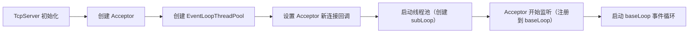
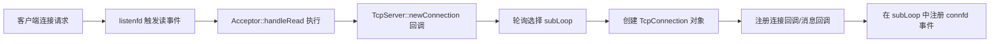
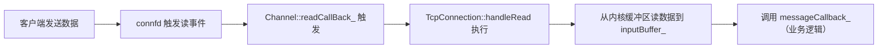

# MyMuduo 网络库使用指南

## 一、项目简介

MyMuduo 是一个基于 Reactor 模式的轻量级网络库，封装了 epoll + 线程池架构，核心优势是分离网络 IO 代码与业务代码，让开发者无需关注底层网络细节，专注于业务逻辑实现。

## 二、环境依赖

- 操作系统：Linux（依赖 epoll 内核机制）
- 编译工具：GCC（支持 C++11 及以上）、CMake 3.5+
- 依赖库：pthread（线程库）

## 三、快速开始

### 1. 编译与安装网络库

通过项目自带的 `autobuild.sh` 脚本可一键完成编译、安装，步骤如下：

```bash
# 1. 克隆项目到本地（假设项目仓库地址为 <repo_url>）
git clone <repo_url> mymuduo && cd mymuduo

# 2. 赋予脚本执行权限
chmod +x autobuild.sh

# 3. 执行自动编译安装脚本（需 root 权限，因要拷贝文件到系统目录）
sudo ./autobuild.sh
```

**脚本执行逻辑**：

- 自动创建 `build` 目录，通过 CMake 生成编译文件并编译
- 编译完成后，将头文件拷贝到 `/usr/include/mymuduo`（系统头文件目录）
- 将动态库 `libmymuduo.so` 拷贝到 `/usr/lib`（系统库目录）
- 执行 `ldconfig` 更新系统库缓存，确保库能被正常链接

### 2. 使用示例：运行回显服务器

项目 `example` 目录下提供了回显服务器示例（`testserver.cc`），可直接编译运行：

```bash
# 1. 进入示例目录
cd example

# 2. 编译示例代码（Makefile 已预设，无需修改）
make

# 3. 运行回显服务器（默认端口可在 testserver.cc 中配置）
./testserver

# 4. 测试服务器（另开终端，使用 telnet 或 nc 发送数据）
telnet 127.0.0.1 <服务器端口>
# 或
nc 127.0.0.1 <服务器端口>
```

**示例效果**：客户端发送的任意数据，服务器会原样返回（回显功能）。

### 3. 自定义业务开发（核心步骤）

若需基于 MyMuduo 开发自己的网络程序，按以下步骤编写代码：

#### 步骤 1：包含核心头文件

```cpp
#include <mymuduo/TcpServer.h>
#include <mymuduo/EventLoop.h>
#include <iostream>
using namespace mymuduo;
```

#### 步骤 2：定义业务回调函数

- 连接回调：处理客户端连接建立 / 断开
- 消息回调：处理客户端发送的数据

```cpp
// 连接回调（连接建立或断开时触发）
void onConnection(const TcpConnectionPtr& conn) {
    if (conn->connected()) {
        std::cout << "新客户端连接：" << conn->peerAddress().toIpPort() << std::endl;
    } else {
        std::cout << "客户端断开连接：" << conn->peerAddress().toIpPort() << std::endl;
    }
}

// 消息回调（接收到客户端数据时触发）
void onMessage(const TcpConnectionPtr& conn, Buffer* buf) {
    // 读取缓冲区数据（buf 为内核缓冲区到应用层的封装）
    std::string msg = buf->retrieveAllAsString();
    std::cout << "收到数据：" << msg << "（来自 " << conn->peerAddress().toIpPort() << "）" << std::endl;
    
    // 业务逻辑处理（此处示例：原样回显）
    conn->send(msg);
}
```

#### 步骤 3：创建服务器并启动

```cpp
int main() {
    // 1. 创建事件循环（Reactor 核心）
    EventLoop loop;
    
    // 2. 配置服务器地址（IP + 端口，示例使用 8080 端口）
    InetAddress addr("0.0.0.0", 8080);
    
    // 3. 创建 TcpServer 实例（参数：事件循环、地址、服务器名称）
    TcpServer server(&loop, addr, "MyCustomServer");
    
    // 4. 设置业务回调函数
    server.setConnectionCallback(onConnection);
    server.setMessageCallback(onMessage);
    
    // 5. 设置线程池大小（子线程数量，处理 IO 事件）
    server.setThreadNum(4);  // 4 个子线程对应 4 个 subLoop
    
    // 6. 启动服务器（开始监听新连接）
    server.start();
    
    // 7. 启动事件循环（阻塞，直到程序退出）
    loop.loop();
    
    return 0;
}
```

#### 步骤 4：编译自定义程序

编写 `Makefile`（参考 example 目录）：

```makefile
# Makefile
test: test.cc
	g++ -o test test.cc -lmymuduo -lpthread -std=c++11

clean:
	rm -rf test
```

编译运行：

```bash
make
./test
```

## 四、关键 API 说明

### 1. TcpServer 核心接口

| 接口                                                         | 功能描述                   |
| ------------------------------------------------------------ | -------------------------- |
| `TcpServer(EventLoop* loop, const InetAddress& addr, const string& name)` | 构造服务器实例             |
| `setConnectionCallback(const ConnectionCallback& cb)`        | 设置连接回调               |
| `setMessageCallback(const MessageCallback& cb)`              | 设置消息回调               |
| `setThreadNum(int numThreads)`                               | 设置线程池大小（子线程数） |
| `start()`                                                    | 启动服务器（开始监听）     |

### 2. TcpConnection 核心接口

| 接口                      | 功能描述               |
| ------------------------- | ---------------------- |
| `connected()`             | 判断连接是否建立       |
| `peerAddress()`           | 获取对端（客户端）地址 |
| `localAddress()`          | 获取本地（服务器）地址 |
| `send(const string& msg)` | 发送数据到客户端       |
| `shutdown()`              | 关闭连接（主动断开）   |

### 3. Buffer 核心接口

| 接口                        | 功能描述                       |
| --------------------------- | ------------------------------ |
| `retrieveAllAsString()`     | 读取缓冲区所有数据并转为字符串 |
| `readableBytes()`           | 获取缓冲区可读数据长度         |
| `append(const string& msg)` | 向缓冲区写入数据（发送时使用） |

## 五、注意事项

1. 编译时必须链接 `mymuduo` 和 `pthread` 库（`-lmymuduo -lpthread`）
2. 事件循环 `loop.loop()` 是阻塞调用，需放在最后执行
3. 线程池大小建议根据 CPU 核心数设置（一般为 CPU 核心数 * 2）
4. 缓冲区 `Buffer` 已处理粘包 / 半包问题，无需手动处理
5. 若需修改服务器端口，直接调整 `InetAddress` 的端口参数即可

# muduo 网络库核心笔记整理

## 一、IO 模型基础

### 1. 网络 IO 的两个核心阶段

- **数据准备**：内核缓冲区中是否有数据可读（或可写）
- **数据读写**：数据从内核缓冲区拷贝到应用缓冲区（或反之）

### 2. 阻塞与非阻塞（数据准备阶段）

- **阻塞 IO**：调用 IO 方法（如 `recv`）时，若数据未就绪，线程进入阻塞状态，直到数据就绪才返回

- 非阻塞 IO

  ：无论数据是否就绪，IO 方法立即返回，需通过返回值判断状态：

  - `size == -1 && errno = EAGAIN`：数据未就绪（正常非阻塞返回）
  - `size == 0`：对端关闭连接
  - `size > 0`：成功读取数据

### 3. 同步与异步（数据读写阶段）

- **同步 IO**：应用程序需等待数据拷贝完成（如 `recv`/`read`），整个过程线程被阻塞
- **异步 IO**：内核完成数据拷贝后通知应用程序（如 `aio_read`/`aio_write`），应用程序无需等待
- **关键结论**：阻塞 / 非阻塞都属于同步 IO，只有使用特殊异步 API 才是异步 IO（`epoll` 是同步 IO）

### 4. 业务层同步与异步

- **同步**：操作 A 等待操作 B 完成并返回结果后再继续
- **异步**：操作 A 告知操作 B 事件和通知方式后继续执行，待 B 完成后通过约定方式通知 A

## 二、Linux 五种 IO 模型

1. 阻塞 IO
2. 非阻塞 IO
3. IO 复用（`select`/`poll`/`epoll`）
4. 信号驱动 IO
5. 异步 IO

## 三、muduo 网络库架构

### 1. 核心设计思想

- 封装 `epoll + 线程池` 架构
- 分离网络 IO 代码与业务代码：用户只需关注连接 / 断开 / 读写事件的业务逻辑

### 2. 核心模块及关系

#### （1）Channel 模块

- **作用**：封装文件描述符（fd）及其感兴趣的事件，绑定事件回调

- **核心成员**：

  ```cpp
  EventLoop* loop_;       // 所属事件循环
  const int fd_;          // 监听的文件描述符
  int events_;            // 感兴趣的事件（如 EPOLLIN/EPOLLOUT）
  int revents_;           // 实际发生的事件
  // 事件回调函数
  ReadEventCallBack readCallBack_;
  EventCallBack writeCallBack_;
  EventCallBack closeCallback_;
  EventCallBack errorCallback_;
  ```

- 两种 Channel 类型：

  - `acceptorChannel`：封装监听套接字（listenfd）
  - `connectionChannel`：封装连接套接字（connfd）

#### （2）Poller/EPollPoller 模块

- **作用**：IO 多路复用器，检测 fd 上的事件（Demultiplex 角色）

- 核心成员：

  ```cpp
  using ChannelMap = std::unordered_map<int, Channel*>;  // fd 到 Channel 的映射
  ChannelMap channels_;
  EventLoop* ownerLoop_;  // 所属事件循环
  ```

- 工作流程：

  1. 监听注册的 fd 事件
  2. 事件发生时，将对应的 Channel 加入活跃列表
  3. 通知 EventLoop 处理活跃 Channel 的回调

#### （3）EventLoop 模块

- **作用**：事件循环（Reactor 角色），驱动事件处理

- 核心成员：

  ```cpp
  ChannelList activeChannels_;        // 活跃的 Channel 列表
  std::unique_ptr<Poller> poller_;    // 关联的 Poller
  int wakeupFd_;                      // 用于唤醒事件循环的文件描述符
  std::unique_ptr<Channel> wakeupChannel_;  // 封装 wakeupFd 的 Channel
  ```

- 关键机制：

  - 通过 `wakeupFd` 实现跨线程唤醒（向 wakeupFd 写入数据可唤醒阻塞的 `epoll_wait`）
  - 循环调用 `poller_->poll()` 获取活跃事件，触发对应 Channel 的回调

#### （4）线程模型（EventLoopThread/EventLoopThreadPool）

- **一对一关系**：1 个线程对应 1 个 EventLoop
- 线程池作用：
  - `baseLoop`（主线程）：处理新连接（监听 listenfd）
  - `subLoop`（子线程）：处理已连接套接字的 IO 事件
  - `getNextLoop()`：通过轮询算法分配 Channel 给 subLoop

#### （5）Acceptor 模块

- **作用**：封装监听套接字（listenfd）的操作
- 核心流程：
  1. 创建非阻塞 listenfd 并绑定地址
  2. 设置读事件回调（`handleRead`），用于处理新连接
  3. 调用 `listen()` 后，将 `acceptorChannel` 注册到 baseLoop

#### （6）TcpConnection 模块

- **作用**：管理一个 TCP 连接（对应一个 connfd）

- 核心成员：

  ```cpp
  std::unique_ptr<Socket> socket_;       // 连接套接字
  std::unique_ptr<Channel> channel_;     // 封装 connfd 的 Channel
  InetAddress localAddr_;                // 本地地址
  InetAddress peerAddr_;                 // 对端地址
  Buffer inputBuffer_;                   // 接收缓冲区
  Buffer outputBuffer_;                  // 发送缓冲区
  // 回调函数（由 TcpServer 设置）
  ConnectionCallback connectionCallback_;
  MessageCallback messageCallback_;
  ```

- 关键流程：

  1. 连接建立后，注册 `EPOLLIN` 事件到 subLoop
  2. 有数据可读时，触发 `handleRead`，读取数据到 `inputBuffer_` 并调用 `messageCallback_`

#### （7）TcpServer 模块

- **作用**：服务器核心类，协调各模块工作

- 核心成员：

  ```cpp
  EventLoop* loop_;                      // baseLoop
  std::unique_ptr<Acceptor> acceptor_;   // 监听新连接
  std::shared_ptr<EventLoopThreadPool> threadPool_;  // 子线程池
  ConnectionMap connections_;            // 管理所有连接
  ```

- 核心流程：

  1. 初始化 Acceptor 和线程池
  2. 为 Acceptor 设置新连接回调（`newConnection`）
  3. 启动线程池和监听（`acceptor_->listen()`）

## 四、核心运行流程

### 1. 服务器启动流程



### 2. 新连接处理流程



### 3. 数据读写流程



## 五、使用方法

1. 定义业务回调函数（连接 / 消息 / 关闭等）
2. 创建 `TcpServer` 实例，设置回调函数
3. 启动服务器（`TcpServer::start()`）
4. 启动 baseLoop 事件循环（`EventLoop::loop()`）

示例伪代码：

```cpp
EventLoop loop;
InetAddress addr(8080);
TcpServer server(&loop, addr, "MyServer");

server.setConnectionCallback([](const TcpConnectionPtr& conn) {
  // 处理连接建立/断开
});

server.setMessageCallback([](const TcpConnectionPtr& conn, Buffer* buf) {
  // 处理接收到的数据
  std::string msg = buf->retrieveAllAsString();
  conn->send(msg);  // 回声服务示例
});

server.start();
loop.loop();  // 启动事件循环
```

## 六、关键设计亮点

- **Reactor 模式**：通过 EventLoop 驱动事件处理，实现高并发
- **线程池隔离**：baseLoop 处理新连接，subLoop 处理 IO 事件，避免阻塞
- **对象生命周期管理**：使用智能指针（`shared_ptr`）管理 TcpConnection 生命周期
- **跨线程通信**：通过 `wakeupFd` 实现高效的线程间事件通知
- **缓冲区设计**：`Buffer` 类解决粘包 / 半包问题，简化数据读写